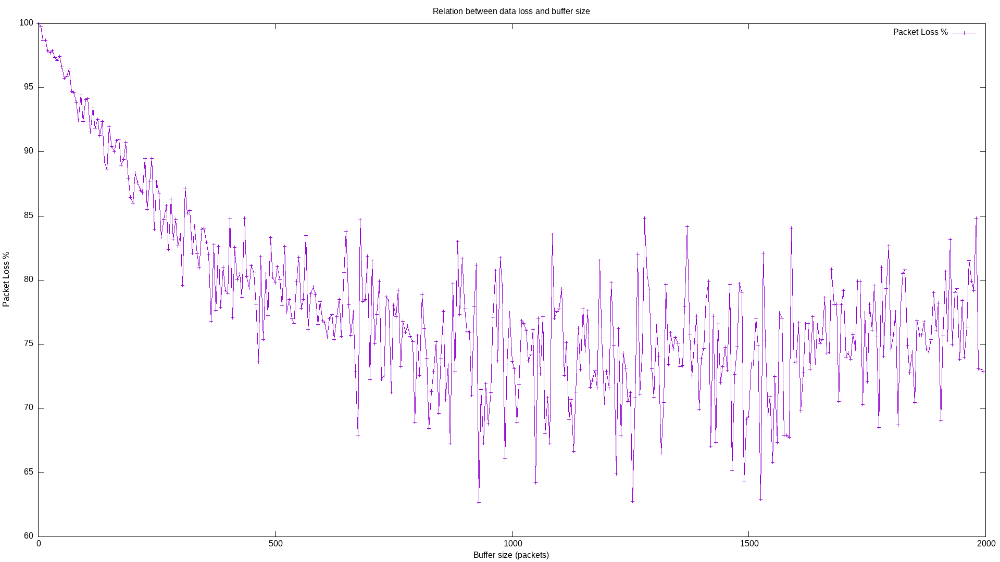

# epidemic-ns3
This is a benchmark tool for [Epidemic routing protocol](http://issg.cs.duke.edu/epidemic/epidemic.pdf) implemented using [ns3](https://www.nsnam.org).

## Running using docker (recommended)
First of all pull the docker image:
```bash
docker pull ghcr.io/herbrant/epidemic-ns3:main
```

Then run the simulation with
```bash
docker run -t ghcr.io/herbrant/epidemic-ns3:main "--PrintHelp"
```

If you want to get the gnuplot's files created during the simulation, bind-mount an host's directory into the container at `/gnuplot/`
```bash
docker run -t -v <your-host-path>:/gnuplot/ ghcr.io/herbrant/epidemic-ns3:main
```

## Building
### Requirements
- [ns3 v3.38](https://www.nsnam.org)
- g++/clang
- cmake
- make
- python3

### Build
First, make sure you have already completed all the step required for the installation of the simulator shown [here](https://www.nsnam.org/docs/installation/html/quick-start.html).

Then clone the repository in the scratch folder:
```bash
cd scratch
git clone https://github.com/Herbrant/epidemic-ns3.git
```

and build the project with
```bash
cd ..
./ns3 run "epidemic-benchmark --PrintHelp"
```

## Usage
The following options are available:
```
Benchmark example shows epidemic routing scenario presented in the original paper.  There are 50 nodes in an area of 1500 m x 300 m. 45 nodes are selected to send a message of size 1KB to the other 44 nodes. The total messages are 45 * 44 = 1980 messages.  The size change after every iteration of the simulation from 0 to the maxQueueLength.  The ranges for the transmission are from 10 m to 250 m while the default is set to 50 m.


Program Options:
    --nWifis:                Number of "extra" Wifi nodes/devices [50]
    --appLogging:            Tell echo applications to log if true [false]
    --nodeSpeed:             Node speed in RandomWayPoint model [10]
    --packetSize:            The packet size [1024]
    --txpDistance:           Specify node's transmit range [50]
    --hopCount:              Specify number of hopCount [50]
    --maxQueueLength:        Specify number of maxQueueLength [200]
    --queueEntryExpireTime:  Specify queue Entry Expire Time [+16.6667min]
    --beaconInterval:        Specify beaconInterval [+5s]

General Arguments:
    --PrintGlobals:              Print the list of globals.
    --PrintGroups:               Print the list of groups.
    --PrintGroup=[group]:        Print all TypeIds of group.
    --PrintTypeIds:              Print all TypeIds.
    --PrintAttributes=[typeid]:  Print all attributes of typeid.
    --PrintVersion:              Print the ns-3 version.
    --PrintHelp:                 Print this help message.
```

## Examples
### Queue Length Benchmark
The QueueLengthBenchmark component allows to verify the relationship between the queue length and the packet loss.
For this example I chose the following parameters:
- maxQueueLength = 2000
- queueStep = 5
- TotalTime = 200

You can run it with
```bash
docker run -t ghcr.io/herbrant/epidemic-ns3:main "--hopCountBenchmark=false --maxQueueLength=2000 --queueStep=5"
```



The next step could be to fix the TotalTime to 400. In this case the packets have more time to propagate. For this reason, the following graph shows a less packet loss.


## HopCount Benchmark
The HopCountBenchmark component allows to verify if there is a relationship between HopCount and packet loss.
For this example I chose the following parameters:
- maxHopCount = 50
- hopCountStep = 1
- TotalTime = 200

You can run it with
```bash
docker run -t ghcr.io/herbrant/epidemic-ns3:main "--queueLengthBenchmark=false --maxHopCount=50 --hopCountStep=1"
```

Furthermore we can repeat the experiment with TotalTime equals to 400 as we did before.


## References
- [ns3](https://www.nsnam.org)
- [gnuplot](http://www.gnuplot.info/)
- [Epidemic Routing for Partially-Connected Ad Hoc Networks](http://issg.cs.duke.edu/epidemic/epidemic.pdf)
- [Epidemic Routing Protocol Implementation in ns-3](https://www.researchgate.net/profile/Dongsheng-Zhang-4/publication/300655340_Epidemic_routing_protocol_implementation_in_ns-3/links/5ab5d7e445851515f59a81f3/Epidemic-routing-protocol-implementation-in-ns-3.pdf)